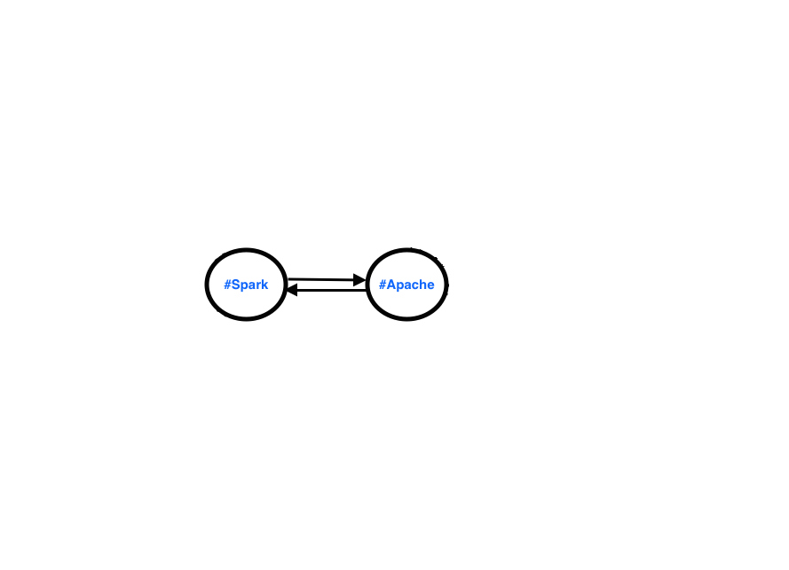
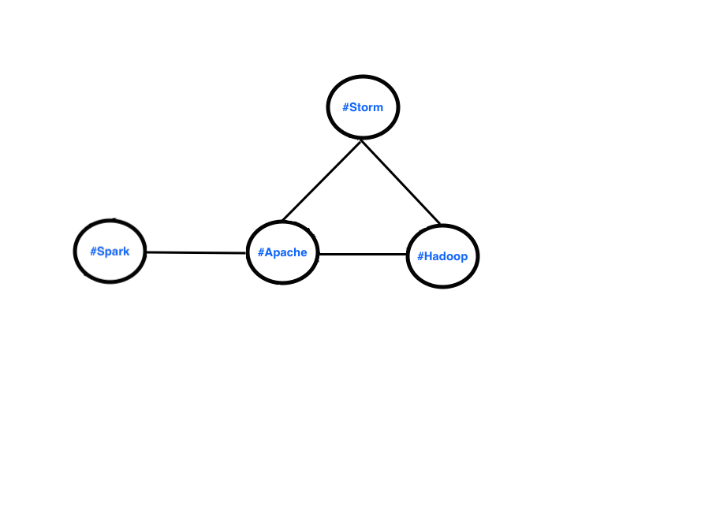
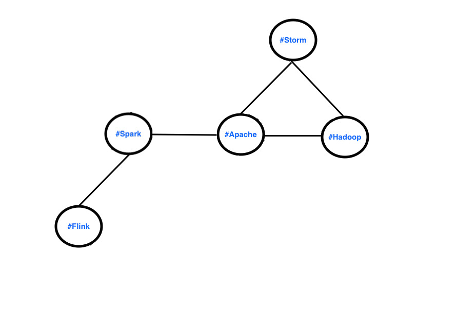
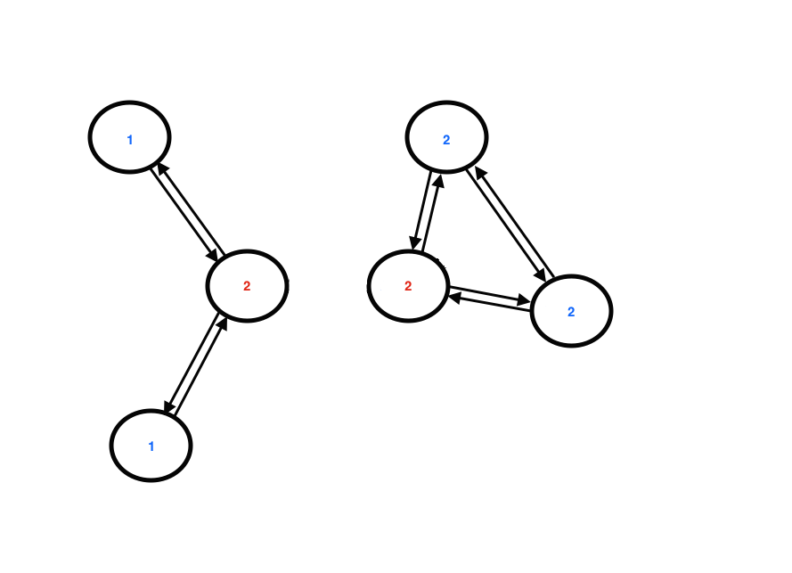
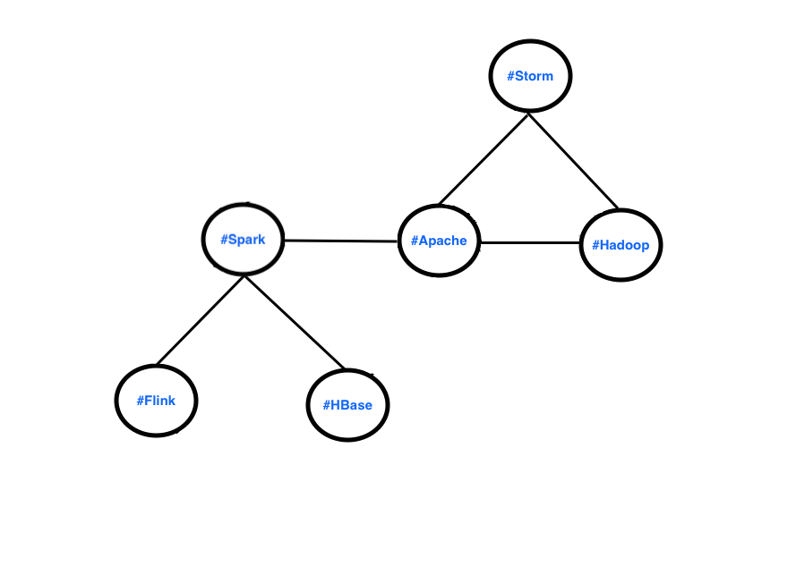
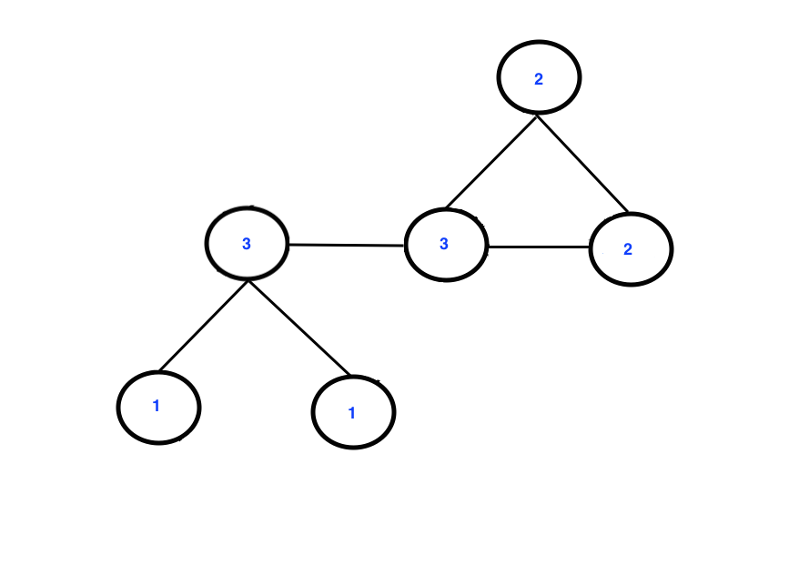
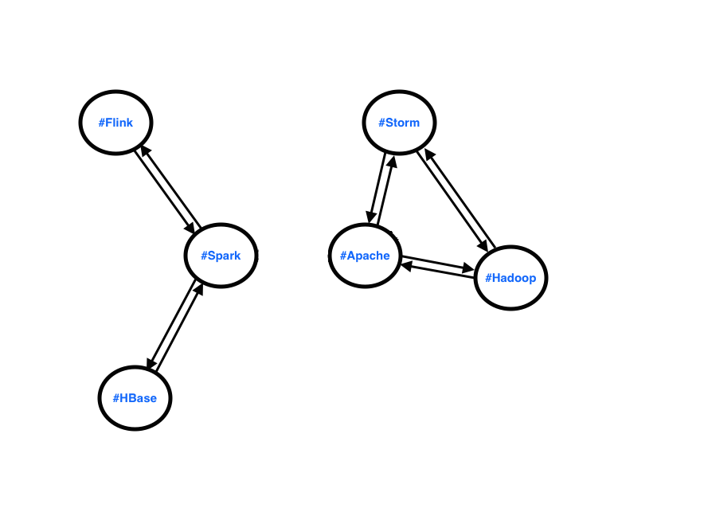
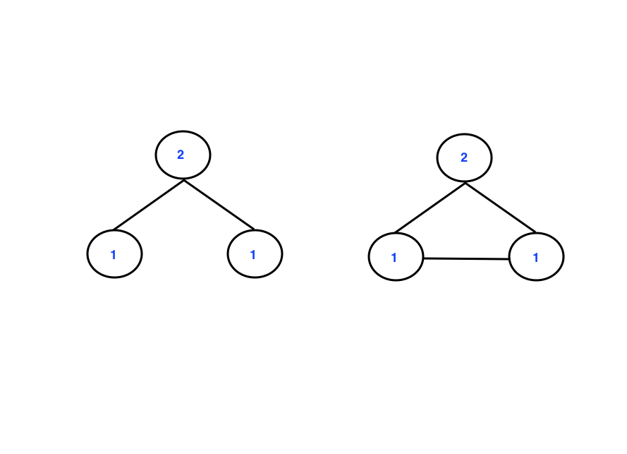
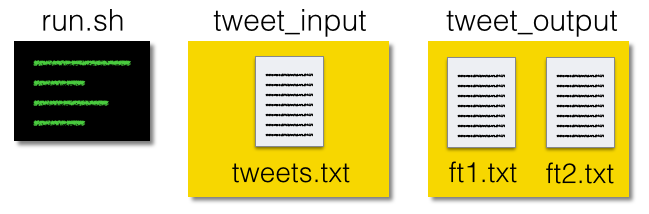

Insight Data Engineering - Coding Challenge
===========================================================

For this coding challenge, you will develop tools that could help analyze the community of Twitter users.  For simplicity, the features we will build are primitive, but you could easily build more complicated features on top of these.   

## Challenge Summary

This challenge is to implement two features:

1. Clean and extract the text from the raw JSON tweets that come from the Twitter Streaming API, and track the number of tweets that required cleaning.
2. Calculate the average degree of a vertex in a Twitter hashtag graph for the last 60 seconds, and update this each time a new tweet appears.

Here, we have to define a few concepts (though there will be examples below to clarify):

- A tweet's text is considered "clean" once all of the escape characters (e.g. \n, \", \/ ) and unicode have been removed.
- A Twitter hashtag graph is a graph connecting all the hashtags that have mentioned together in a single tweet.

## Details of Implementation

We'd like you to implement your own version of these two features.  However, we don't want this challenge to focus on the relatively uninteresting "dev ops" of connecting to the Twitter API, which can be complicated for some users.  Normally, tweets can be obtained through Twitter's API in JSON format, but you may assume that this has already been done and written to a file named `tweets.txt` inside a directory named `tweet_input`.  For simplicity, this file `tweets.txt` will only contain the actual JSON messages (in reality, the API also can emit messages about the connection and the API rate limits).  Additionally, `tweets.txt` will have the content of each tweet on a newline:

tweets.txt:

	{JSON of first tweet}  
	{JSON of second tweet}  
	{JSON of third tweet}  
	.
	.
	.
	{JSON of last tweet}  

## First Feature

The point of the first feature is to extract and clean the relevant data for the Twitter JSON messages.  For example, a typical tweet might come in the following JSON message:

<pre>
{"created_at":"<b>Thu Oct 29 17:51:01 +0000 2015</b>","id":659789759787589632,
 "id_str":"659789759787589632","text":"<b>Spark Summit East this week! #Spark #Apache</b>",
 "source":"\u003ca href=\"http:\/\/twitter.com\" rel=\"nofollow\"\u003eTwitter Web Client\u003c\/a\u003e",
 "truncated":false,"in_reply_to_status_id":null,"in_reply_to_status_id_str":null,
 "in_reply_to_user_id":null,"in_reply_to_user_id_str":null,"in_reply_to_screen_name":null,
 "user":{"id":40077534,"id_str":"40077534","name":"scott bordow","screen_name":"sbordow",
 "location":null,"url":null,"description":"azcentral sports high school sports columnist. If you send me a tweet, you consent to letting azcentral sports use and showcase it in any media.",
 "protected":false,"verified":true,"followers_count":4704,"friends_count":2249,"listed_count":94,
 "favourites_count":51,"statuses_count":15878,"created_at":"Thu May 14 20:36:46 +0000 2009",
 "utc_offset":-25200,"time_zone":"Pacific Time (US & Canada)","geo_enabled":true,"lang":"en",
 "contributors_enabled":false,"is_translator":false,"profile_background_color":"C0DEED",
 "profile_background_image_url":"http:\/\/abs.twimg.com\/images\/themes\/theme1\/bg.png",
 "profile_background_image_url_https":"https:\/\/abs.twimg.com\/images\/themes\/theme1\/bg.png",
 "profile_background_tile":false,"profile_link_color":"0084B4","profile_sidebar_border_color":"C0DEED",
 "profile_sidebar_fill_color":"DDEEF6","profile_text_color":"333333","profile_use_background_image":true,
 "profile_image_url":"http:\/\/pbs.twimg.com\/profile_images\/576178462496423936\/YnOZ-StV_normal.jpeg",
 "profile_image_url_https":"https:\/\/pbs.twimg.com\/profile_images\/576178462496423936\/YnOZ-StV_normal.jpeg",
 "default_profile":true,"default_profile_image":false,"following":null,"follow_request_sent":null,"notifications":null},
 "geo":null,"coordinates":null,"place":{"id":"a612c69b44b2e5da","url":"https:\/\/api.twitter.com\/1.1\/geo\/id\/a612c69b44b2e5da.json","place_type":"admin","name":"Arizona","full_name":"Arizona, USA","country_code":"US",
 "country":"United States","bounding_box":{"type":"Polygon","coordinates":[[[-114.818269,31.332246],[-114.818269,37.004261],[-109.045152,37.004261],[-109.045152,31.332246]]]},
 "attributes":{}},"contributors":null,"is_quote_status":false,"retweet_count":0,"favorite_count":0,
 "entities":{"hashtags":[],"urls":[],"user_mentions":[],"symbols":[]},
 "favorited":false,"retweeted":false,"filter_level":"low","lang":"en","timestamp_ms":"1446141111691"
}  
</pre>

Where the relevant text that we want to extract has been bolded.

Your program should output the results of this first feature to a text file named `ft1.txt` in a directory named `tweet_output`, with each new tweet on a newline.

## Second Feature
The second feature will continually update the Twitter hashtag graph and hence, the average degree of the graph. The graph should just be built using tweets that arrived in the last 60 seconds as compared to the timestamp of the latest tweet. As new tweets come in, edges formed with tweets older than 60 seconds from the timstamp of the latest tweet should be evicted. For each incoming tweet, only extract the following fields in the JSON response
* "hastags" - hashtags found in the tweet
* "created_at" - timestamp of the tweet

### Building the Twitter Hashtag Graph
Example of 4 tweets
```
Spark Summit East this week! #Spark #Apache (timestamp: Thu Oct 29 17:51:01 +0000 2015)
Just saw a great post on Insight Data Engineering #Apache #Hadoop #Storm (timestamp: Thu Oct 29 17:51:30 +0000 2015)
Doing great work #Apache (timestamp: Thu Oct 29 17:51:55 +0000 2015)
Excellent post on #Flink and #Spark (timestamp: Thu Oct 29 17:51:56 +0000 2015)
```

Extracted hashtags from each tweet
```
#Spark, #Apache (timestamp: Thu Oct 29 17:51:01 +0000 2015)
#Apache, #Hadoop, #Storm (timestamp: Thu Oct 29 17:51:30 +0000 2015)
#Apache (timestamp: Thu Oct 29 17:51:55 +0000 2015)
#Flink, #Spark (timestamp: Thu Oct 29 17:51:56 +0000 2015)
```

Two hashtags will be connected if and only if they are present in the same tweet. Only tweets that contain two or more **DISTINCT** hashtags can create new edges.

A good way to create this graph is with an edge list where an edge is defined by two hashtags that are connected. 

The edge list made by all the above tweets is as follows:
```
#Spark <-> #Apache

#Apache <-> #Hadoop
#Hadoop <-> #Storm
#Storm <-> #Apache

#Flink <-> #Spark
```

Notice that the third tweet did not generate a new edge since there were no other hashtags besides `#Apache` in that tweet. Also, all tweets occured in the 60 seconds time window as compared to the latest tweet and they all are included in building the graph.

The edge list can be visualized with the following diagrams where each node is a hashtag. The first tweet will generate the `#Spark` and `#Apache` nodes.



The second tweet contains 3 hashtags `#Apache`, `#Hadoop`, and `#Storm`. `#Apache` already exists, so only `#Hadoop` and `#Storm` are added to the graph.



The third tweet generated no edges, so no new nodes will be added to the graph.

The fourth tweet contains `#Flink` and `#Spark`. `#Spark` already exists, so only `#Flink` will be added.



We can now calculate the degree of each node which is defined as the number of connected neighboring nodes.



The average degree for simplicity will be calculated by summing the degrees of all nodes in all graphs and dividing by the total number of nodes in all graphs.

Average Degree = (1+2+3+2+2)/5 = 2.00

The rolling average degree is now 
```
2.00
```

### Modifying the Twitter Hashtag Graph with Incoming Tweet
Now let's say another tweet has arrived
```
New and improved #HBase connector for #Spark (timestamp: Thu Oct 29 17:51:59 +0000 2015)
```

The extracted hashtags are then
```
#HBase, #Spark (timestamp: Thu Oct 29 17:51:59 +0000 2015)
```

and added to the edge list
```
#Spark <-> #Apache

#Apache <-> #Hadoop
#Hadoop <-> #Storm
#Storm <-> #Apache

#Flink <-> #Spark

#HBase <-> $Spark
```

The graph now looks like the following



with the updated degree calculation for each node. Here only `#Spark` needs to be incremented due to the additional `#HBase` node.



The average degree will be recalculated using the same formula as before.

Average Degree = (1+3+1+3+2+2)/6 = 2.00

The rolling average degree is now 
```
2.00
2.00
```

### Maintaining Data within the 60 Second Window
Now let's say that the next tweet that comes in has the following timestamp
```
New 2.7.1 version update for #Hadoop #Apache (timestamp: Thu Oct 29 17:52:05 +0000 2015)
```

The full list of tweets now is 
```
Spark Summit East this week! #Spark #Apache (timestamp: Thu Oct 29 17:51:01 +0000 2015)
Just saw a great post on Insight Data Engineering #Apache #Hadoop #Storm (timestamp: Thu Oct 29 17:51:30 +0000 2015)
Doing great work #Apache (timestamp: Thu Oct 29 17:51:55 +0000 2015)
Excellent post on #Flink and #Spark (timestamp: Thu Oct 29 17:51:56 +0000 2015)
New and improved #HBase connector for #Spark (timestamp: Thu Oct 29 17:51:59 +0000 2015)
New 2.7.1 version update for #Hadoop #Apache (timestamp: Thu Oct 29 17:52:05 +0000 2015)
```

We can see that the very first tweet has a timestamp that is more than 60 seconds behind this new tweet. This means that we do not want to include this tweet in our average degree calculation.

The new hashtags to be used are as follows
```
#Apache, #Hadoop, #Storm (timestamp: Thu Oct 29 17:51:30 +0000 2015)
#Apache (timestamp: Thu Oct 29 17:51:55 +0000 2015)
#Flink, #Spark (timestamp: Thu Oct 29 17:51:56 +0000 2015)
#HBase, #Spark (timestamp: Thu Oct 29 17:51:59 +0000 2015)
#Hadoop #Apache (timestamp: Thu Oct 29 17:52:05 +0000 2015)
```

The new edge list only has the `#Spark` <-> `#Apache` edge removed since `#Hadoop` <-> `#Apache` from the new tweet already exists in the edge list.
```
#Apache <-> #Hadoop
#Hadoop <-> #Storm
#Storm <-> #Apache

#Flink <-> #Spark

#HBase <-> $Spark
```

The old graph has now been disconnected forming two graphs.



We'll then calculate the new degree for all the nodes in both graphs.



Recalculating the average degree of all nodes in all graphs is as follows
Average Degree = (1+2+1+2+2+2)/6 = 1.67

Normally the average degree is calculated for a single graph, but maintaining multiple graphs for this problem can be quite difficult. For simplicity we are only interested in calculating the average degree of of all the nodes in all graphs despite them being disconnected.

The rolling average degree is now 
```
2.00
2.00
1.67
```

## Collecting tweets from the Twitter API
Ideally, the second feature that updates the average degree of a Twitter hashtag graph as each tweet arrives would be connected to the Twitter streaming API and would add new tweets to the end of `tweets.txt`.  However, connecting to the API requires more system specific "dev ops" work, which isn't the primary focus for data engineers.  Instead, you should simply assume that each new line of the text file corresponds to a new tweet and design your program to handle a text file with a large number of tweets.  Your program should output the results of this second feature to a text file named `ft2.txt` in the `tweet_output` directory.

You may write your solution in any mainstream programming language such as C, C++, C#, Clojure, Erlang, Go, Haskell, Java, Python, Ruby, or Scala - then submit a link to a Github repo with your source code.  In addition to the source code, the top-most directory of your repo must include the `tweet_input` and `tweet_output` directories, and a shell script named `run.sh` that compiles and runs the program(s) that implement these features.  If your solution requires additional libraries, environments, or dependencies, you must specify these in your README documentation.  See the figure below for the required structure of the top-most directory in your repo, or simply clone this repo.

## Repo directory structure


Alternatively, here is example output of the `tree` command:

	├── README.md  
	├── run.sh  
	├── src  
	│   ├── median_unique.py  
	│   └── words_tweeted.py  
	├── tweet_input  
	│   └── tweets.txt  
	└── tweet_output  
	    ├── ft1.txt  
	    └── ft2.txt  

As a data engineer, it’s important that you write clean, well-documented code that scales for large amounts of data.  For this reason, it’s important to ensure that your solution works well for a huge number of tweets, rather than just the simple examples above.  For example, your solution should be able to process a file containing a week of tweets without taking much longer than processing only an hour of tweets.  For more details about the implementation, please refer to FAQ below or email us at info@insightdataengineering.com


## FAQ

Here are some common questions we've received.  If you have additional questions, feel free fork this repo, add them to the README.md, then issue a pull request.  Alternatively, you can email cc@insightdataengineering.com and we'll add the answers.

* *Which Github link should I submit?*  
You should submit the URL for the top-level root of your repository.  For example, this repo would be submitted by copying the URL `https://github.com/InsightDataScience/cc-example` into the appropriate field on the application.  Please do NOT try to submit your coding challenge using a pull request, which will make your source code publicly available.  

* *Do I need a private Github repo?*  
No, you may use a public repo, there is no need to purchase a private repo.   

* *Do you have any larger sample inputs?*  
Yes, we have just added an example input with 10,000 tweets in the `data-gen` directory of this repo.  It also contains a simplified producer that can connect to the live Twitter API and clean the data to conform to input requirements of this data challenge.  This is not required for this challenge, but may be helpful for testing your solution.  

* *May I use R or other analytics programming languages to solve the challenge?*  
While you may use any programming language to complete the challenge, it's important that your implementation scales to handle large amounts of data.  Many applicants have found that R is unable to process data in a scalable fashion, so it may be more practical to use another language.  

* *May I use distributed technologies like Hadoop or Spark?*  
While you're welcome to use any language or technology, it will be tested on a single machine so there may not be a significant benefit to using these technologies prior to the program.  With that said, learning distributed systems would be a valuable skill for all data engineers.

* *What sort of system should I use to run my program on (Windows, Linux, Mac)?*  
You may write your solution on any system, but your code should be portable and work on all systems.  You should also specify your environment and system in your accompanying README file.  

* *How should punctuation be handled?*  
Please don't worry about punctuation for this challenge.  In theory, you could spend a lot of time in details related to natural language processing (NLP), but this isn't the intended focus for the challenge.  The only "punctuation" you need to worry about are whitespaces, which are the delimiters between words.  

* *Can I use pre-built packages, modules, or libraries?*   
Yes, you may use any publicly available package, module, or library as long as you document any dependencies in your accompanying `README` file.  When we review your submission, we will download these libraries and attempt to run your program.   This is why it's very important that you document any dependencies or system specific details in your accompanying README file.  However, you should always ensure that the module you're using works efficiently for the specific use-case in the challenge, many libraries are not designed for large amounts of data.

* *Do I need to use multi-threading?*   
No, your solution doesn't necessarily need to include multi-threading - there are many solutions that don't require multiple threads/cores or any distributed systems.  

* *Do I need to account for and updating `tweets.txt` file?*   
No, your solution doesn't have to re-process `tweets.txt`.  Instead, it should be designed to handle a very large input size.  If you were doing this project as a data engineer in industry, you would probably re-run your program daily to handle batches, but this is beyond the scope of this challenge.  

* *What should the format of the word count be?*  
Please try to match the above example, by listing the words in **alphabetical** order according the the ASCII ordering, with whitespace between the word and count, and each word separated by a newline.

* *What should the precision for the output of the median be?*  
For simplicity, please output the running median as a double with only 1 digit after the decimal (i.e. 2.0 instead of 2).  The median for each new tweet of text should be separated by newlines as shown in the example above.

* *Do I need to account for complicated Unicode characters?*  
No, you may assume that all of the characters are conventional, ASCII characters.

* *Should I check if the files in the input directory are text files or non-text files(binary)?*  
No, for simplicity you may assume that all of the files in the input directory are standard text files.  

* *Do I need to account for empty tweets?*  
No, for simplicity you may assume that all the tweets contain at least one word.  

* *Do I need separate programs for different features?*  
You may use a single combined program or several programs, as long as they are all executed by the `run.sh` script.

* *Can I use an IDE like Eclipse to write my program?*  
Yes, you can use what ever tools you want -  as long as your `run.sh` script correctly runs the relevant target files and creates the `ft1.txt` and `ft2.txt` files in the `tweet_output` directory.

* *What should be in the `tweet_input` directory?*  
You can put any text file you want in the directory.  In fact, this could be quite helpful for testing your solutions.

* *How will the coding challenge be evaluated?*  
Generally, we will evaluate your coding challenge with a testing suite that provides a variety of input tweets and checks the corresponding output.  This suite will attempt to use your 'run.sh' and is fairly tolerant to different output formats.  Of course, there are many aspects that cannot be tested by our suite, so each submission will be reviewed by a person as well. 

* *How long will it take for me to hear back from you about my submission?*  
We receive hundreds of submissions and try to evaluate them all in a timely manner.  We try to get back to all applicants within two or three weeks of submission, but if you have a specific deadline that requires expedited review, you may email us at cc@insightdataengineering.com.  

